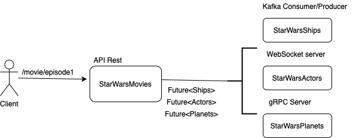

# reactiveStarWars

A Star wars reactive microservice platform, formed by four services:
* **StarWarsMovie:** Rest API microservice. The entry point of the platform which orchestrate and gather the information for the client.
* **StarWarsActors:** WebSocket microservice. It contains the information of characters per episode.
* **StarWarsPlanets:** gRPC microservice. It contains the information of planets per episode.
* **StarWarsShips:** Kafka microservice. It contains the information of ships per episode.
 
    

In this platform, we apply different reactive technologies not only to communicate between microservice,
but also to be NIO and control side-effect.

As Http Server technology we use [Vertx](https://vertx.io) in his latest version, which provide the different patterns to
communicate between services like ````WebSocket```` or ```gRPC```

For ````Event driven```` pattern we use  [Kafka Alpakka](https://doc.akka.io/docs/alpakka-kafka/current/home.html) a Kafka
 Akka library implemented in top of Apache Kafka.

For ```NIO``` and ```Side-effects```  we use functional programing library [Vavr](https://www.vavr.io) 
which provide a ```Future```, ```Option```, ```Try``` and ```Either``` like in Scala lang.

### Building

In each gradle module you can run the different task using gradle commands:

To launch your tests:
```
./gradlew clean test
```

To package your application:
```
./gradlew clean assemble
```


### Running

* Before run the platform is mandatory have Kafka image up and running.
Having docker-compose installed run in the root folder of project the command:
````
docker-compose up -d
````

* To run the four microservice you can use the main class of the ```TestFramework``` module 
[here](TestFramework/src/main/java/com/politrons/main/startWarsPlatformMain.java)


